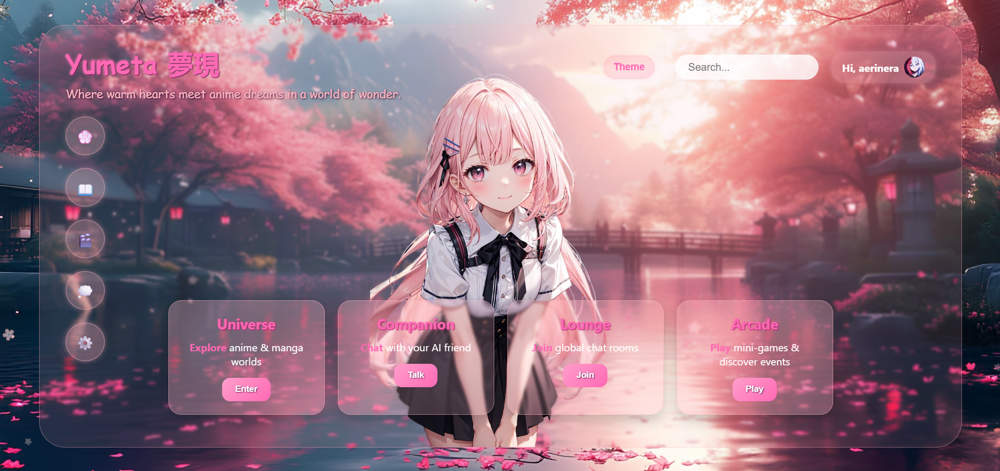

  

<h1 align="center" style="font-family: 'serif'; letter-spacing: 1px;">
  夢田 - Yumeta
</h1>

<i>A gentle universe for those who dream in anime.</i>

---

## ❖ About Yumeta

Yumeta is not just a platform—it's a world.  
A soft and immersive space where anime, manga, and human-like AI companions meet.

- Watch anime alone or live-sync with friends.
- Read manga together, page by page.
- Join heartful global conversations or wander themed rooms.
- Talk to intelligent AI companions who remember and respond like friends.
- All wrapped in an aesthetic inspired by gentle evenings and falling sakura.

---

## ❖ Preview

Here’s a look into our current homepage:

  

---

## ❖ Tech & Roadmap

Yumeta began with a solid foundation of **HTML, CSS, and JavaScript**, crafting a clean and responsive interface.

Looking forward, the platform will evolve with immersive and interactive features:

- **Dynamic Anime & Manga Selector:**  
  Instead of simple dropdowns, users will engage with an interactive character-selection panel reminiscent of fighting games.  
  Selecting a character or category will illuminate that side with smooth animations, while the other dims subtly—creating an intuitive and visually captivating navigation experience.  
  This will lead to rich experiences like synchronized anime streaming and shared manga reading.

- **Custom-built AI Chat Companions:**  
  Developing an in-house AI conversational system based on lightweight machine learning techniques, aiming for natural and heartfelt interactions without relying on large external LLM services.

- **Global & Themed Chat Rooms:**  
  Real-time spaces where fans gather, share, and celebrate their passion together.

- **Rewards, Games & Exclusive Content:**  
  Engage with the platform to earn Yumeta Coins, unlocking special content, mini-games, and unique experiences designed to deepen your connection to the community.

---

###  ❖ Technologies by Phase

| Phase               | Technologies                          |
|---------------------|------------------------------------|
| Frontend             | HTML, CSS, JavaScript               |
| UI Effects & Animations    | CSS Animations, Vanilla JavaScript  |
| Video Playback       | HTML5 Video API, Custom Player UI(JavaScript)   |
| AI Chat              | Python, TensorFlow / PyTorch (ML Basics) |
| Real-Time Chat Rooms | WebSocket, Node.js / FastAPI        |
| Rewards & Mini-Games Backend       |  Node.js / Python,PostgreSQL / Redis |

---

With this roadmap, Yumeta aims to become a unique universe blending anime, manga, AI, and social interaction into one cozy experience.

---

## ❖ Status

Yumeta is in its early bloom.  
The roots are growing deep—this is just the beginning of our journey.

---

